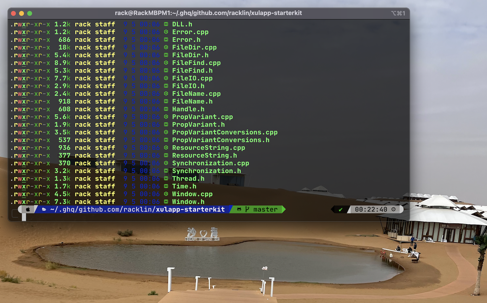

# Rack Lin's dotfiles

I am using [GNU Stow](https://www.gnu.org/software/stow/) - a symlink farm manager to manage dotfiles.

**Warning**: Don’t blindly use my settings unless you know what that entails. Use at your own risk!

## Prerequisites
Make sure you have installed all of the following prerequisites on your development machine:
- [GNU Stow](https://www.gnu.org/software/stow/) > 2.3.0 that support new `--dotfiles` option
- [z for fish](https://github.com/jethrokuan/z) - Directory jumping
- [Exa](https://the.exa.website/) - `ls` replacement
- [ghq](https://github.com/x-motemen/ghq) - Local Git repository organizer
- [fzf](https://github.com/junegunn/fzf) - is a general-purpose command-line fuzzy finder.

## Contents

- git config
- zsh config
  - [oh-my-zsh](https://github.com/ohmyzsh/ohmyzsh)
    ```
    sh -c "$(curl -fsSL https://raw.github.com/ohmyzsh/ohmyzsh/master/tools/install.sh)"
    ```
  - [powerlevel10k theme](https://github.com/romkatv/powerlevel10k)
    ```
    git clone --depth=1 https://github.com/romkatv/powerlevel10k.git ${ZSH_CUSTOM:-$HOME/.oh-my-zsh/custom}/themes/powerlevel10k
    ```
- tmux config
- MacOSX config
  
## How to use

### git
Let’s stow git setting, 
`stow --dotfiles -vSt ~ git`
That’s it! we have successfully created a symlink for `.gitconfig` ,and a symlink for `.gitignore_global`

### zsh
`stow --dotfiles -vSt ~ zsh`

### fish shell
`mkdir ~/.config/fish`
`stow --dotfiles -vSt ~/.config/fish fish`

### tmux
`stow --dotfiles -vSt ~ tmux`

### starship
`stow --dotfiles -vSt ~/.config starship`


## About me

- [Twitter](https://twitter.com/racklin)
- [github](https://github.com/racklin)
